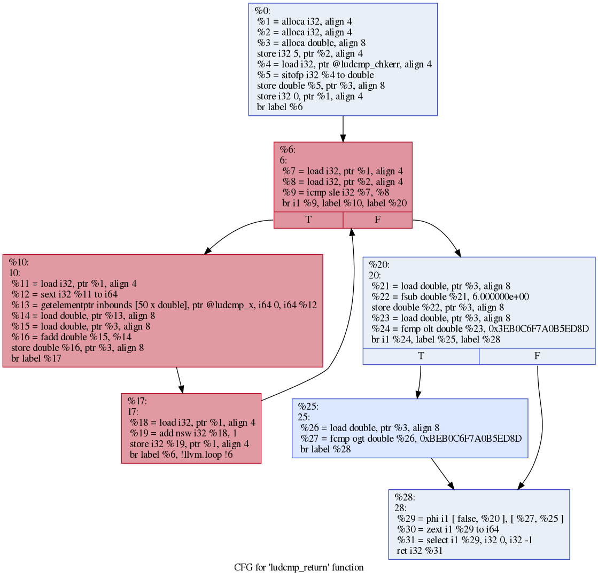

# Exercise 1

## Requirements

At this point you should have successfully finished the Setup in the Readme and be able to build the project. You have also amde yourself familiar with the different LLVM Passes and how they work.

## Goals
In this exercise you will learn how to write a LLVM Pass and traverse the Code of a programm and to work with Values.

## Documentation

### Links

LLVM Intermediate Representation (IR): [LangRef](https://llvm.org/docs/LangRef.html)
LLVM Programmers Manual: [Manual](https://llvm.org/docs/ProgrammersManual.html)

### Static Single-Assignment (SSA)
Is an intermediate language for compilers, which restricts every variable to be assigned only once and they have to be defined before they are used. The follwing two examples are not allowed in SSA:

```cpp
int a = 5
int b = 6
a = a + b // Not allowed in SSA
```

```cpp
int a;
b = a + 1 // Not allowed in SSA
```

However this comes with the issue that a simple if else statement can not be realized. For example try to convert the following to SSA. (spoiler: you can not do this for now.)
```cpp
int b;
if (a) {
  b = 1;
} else {
  b = 2;
}
// Do sth with b
```
Or the Following Loop:
```cpp
for(int i = 0 ; ; i++) {}
```
This form of a program is prohibited by the rule of single assignment. So a $\Phi$ ([Phi](https://llvm.org/docs/LangRef.html#phi-instruction)) function is needed. It looks like this:
```llvm
Loop:       ; Infinite loop that counts from 0 on up...
  %indvar = phi i32 [ 0, %LoopHeader ], [ %nextindvar, %Loop ]
  %nextindvar = add i32 %indvar, 1
  br label %Loop
```

To give a non trivial example, we use the follwing code:
```cpp
int ludcmp_return( void )
{
  int i, n = 5;
  double checksum = ludcmp_chkerr;

  _Pragma( "loopbound min 6 max 6" )
  for ( i = 0; i <= n; i++ )
    checksum += ludcmp_x[ i ];

  /* allow rounding errors for the checksum */
  checksum -= 6.0;
  return ( ( checksum < 0.000001 && checksum > -0.000001 ) ? 0 : -1 );
}
```

Which looks like this in the LLVM IR:
```llvm
; Function Attrs: noinline nounwind uwtable
define dso_local i32 @ludcmp_return() #0 {
  %1 = alloca i32, align 4
  %2 = alloca i32, align 4
  %3 = alloca double, align 8
  store i32 5, ptr %2, align 4
  %4 = load i32, ptr @ludcmp_chkerr, align 4
  %5 = sitofp i32 %4 to double
  store double %5, ptr %3, align 8
  store i32 0, ptr %1, align 4
  br label %6

6:                                                ; preds = %17, %0
  %7 = load i32, ptr %1, align 4
  %8 = load i32, ptr %2, align 4
  %9 = icmp sle i32 %7, %8
  br i1 %9, label %10, label %20

10:                                               ; preds = %6
  %11 = load i32, ptr %1, align 4
  %12 = sext i32 %11 to i64
  %13 = getelementptr inbounds [50 x double], ptr @ludcmp_x, i64 0, i64 %12
  %14 = load double, ptr %13, align 8
  %15 = load double, ptr %3, align 8
  %16 = fadd double %15, %14
  store double %16, ptr %3, align 8
  br label %17

17:                                               ; preds = %10
  %18 = load i32, ptr %1, align 4
  %19 = add nsw i32 %18, 1
  store i32 %19, ptr %1, align 4
  br label %6, !llvm.loop !9

20:                                               ; preds = %6
  %21 = load double, ptr %3, align 8
  %22 = fsub double %21, 6.000000e+00
  store double %22, ptr %3, align 8
  %23 = load double, ptr %3, align 8
  %24 = fcmp olt double %23, 0x3EB0C6F7A0B5ED8D
  br i1 %24, label %25, label %28

25:                                               ; preds = %20
  %26 = load double, ptr %3, align 8
  %27 = fcmp ogt double %26, 0xBEB0C6F7A0B5ED8D
  br label %28

28:                                               ; preds = %25, %20
  %29 = phi i1 [ false, %20 ], [ %27, %25 ]
  %30 = zext i1 %29 to i64
  %31 = select i1 %29, i32 0, i32 -1
  ret i32 %31
}
```

And the control flow through the BaiscBlocks (BBs), explained in next section, looks like:


### BasicBlock (BB)
A BB is the longest sequence of instructions that are executed in a linear manner. This means that a BB starts at a point, where another position in the control flow points too. And a BB ends by pointing to other BBs. Each square in the above Control Flow Graph (CFG) contains a BB.

### ControllFlowGraph (CFG)

The CFG is a graph that visualizes and models the flow of a program. For example a loop would be a circle in the CFG. Again the above figure is a CFG a single function of a program.

## Exercise

First make yourself familiar with the LLVM IR, using both the web documentation from LLVM and the small part written here. Make sure you have a good idea of the LLVM IR, since we will be working on it from now on.

Second go back to FpPass.cpp from exercise 0 and implement some loops that iterate over the whole program. See the LLVM Programmers Manual in scetion [helpful hints for common operations](https://llvm.org/docs/ProgrammersManual.html#helpful-hints-for-common-operations) for help. Try to print all add instructions with your pass. To check for Instruction types use the [dyn_cast<>](https://llvm.org/docs/ProgrammersManual.html#important-and-useful-llvm-apis).
